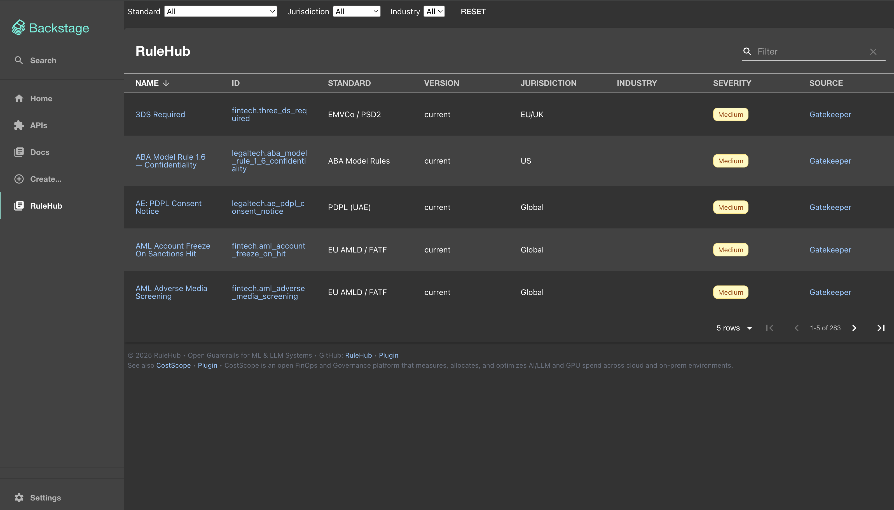
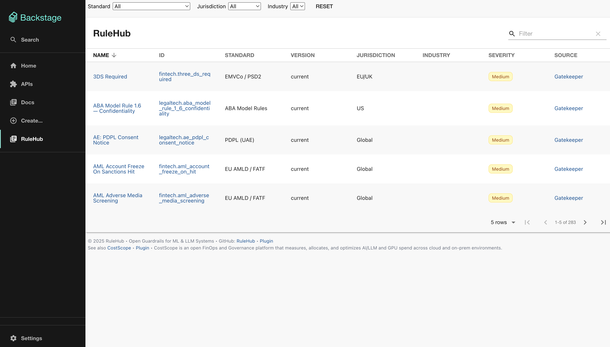

# RuleHub — Backstage Policy Catalog Plugin

[](https://www.npmjs.com/package/@rulehub/rulehub-backstage-plugin) [](LICENSE) [](https://github.com/rulehub/rulehub-backstage-plugin/actions/workflows/ci.yml)

Lightweight Backstage plugin that turns a static policy index into a beautiful, fast, and read-only compliance catalog.

Why use this plugin?

- Ship a policy catalog in minutes — no backend required.
- Low maintenance: static JSON index + static hosting = minimal ops.
- Fast and accessible UI designed for engineers and auditors.
- Integrates smoothly into Backstage with a tiny bundle and simple configuration.

## Demo





```bash
npm run demo
```

See more [docs/demo-and-scripts.md](docs/demo-and-scripts.md).

## What it does

Turn your policies into a clean, searchable catalog inside Backstage — with zero backend.

- Browse and discover policy packages by standard, jurisdiction, industry, and more.
- One static JSON powers the entire view; host it anywhere (GitHub Pages, CDN, your app).
- Clear outbound links to source files so engineers jump straight to code; auditors get a fast, accessible view.

## Key features & competitive advantages

- Zero-backend architecture: serve a single JSON file from your app or CDN.
- Instant integration: add a route and a single config key to get started.
- Minimal bundle and dependencies — keeps your Backstage app snappy.
- Read-only by design — ideal for audit-friendly, reproducible policy views.
- Customizable styling and theming to match your Backstage instance.
- Open-source with focused docs and examples for index generation and deployment.

## Quick start (3 steps)

1. Install the plugin:

   npm install @rulehub/rulehub-backstage-plugin

2. Add the route (see example above).

3. Point the plugin to the hosted index (default):

- Official hosted indexes (JSON):
  - charts: `https://rulehub.github.io/rulehub-charts/plugin-index/index.json`
  - core: `https://rulehub.github.io/rulehub/plugin-index/index.json`

Open /rulehub ind your Backstage app.

For end-to-end setup, index generation, and advanced integration patterns, see the full guide in `docs/DETAILED_GUIDE.md`.

## Documentation

Looking for the full documentation index? See `docs/README.md`.

Start here — suggested reading order:

1. Try the demo

- `docs/demo-and-scripts.md` — quick commands to run a local demo (full app or frontend‑only)

2. Install into your Backstage app

- `docs/short-example-integration.md` — minimal lazy‑route example
- `docs/DETAILED_GUIDE.md#full-installation--integration` — full step‑by‑step guide

3. Configure

- `docs/configuration-minimal.md` — copy‑paste config
- `docs/BACKSTAGE_CONFIG_EXAMPLE.yaml` — richer example with links

4. Test and verify

- `docs/testing.md` — unit/E2E, coverage, tips
- `docs/troubleshooting.md` — common issues and fixes

Optional / deep dive

- `docs/DETAILED_GUIDE.md` — all details (filters, runtime overrides, serving index, etc.)
- `docs/localization-overrides.md` — labels/translations
- `docs/bundle-size-budgets.md` — monitor bundle size
- `docs/architecture.md` — internal structure
- `docs/install-and-automation.md` — scripted wiring into an existing app

## Community & Links

- Plugin repo (this project): [https://github.com/rulehub/rulehub-backstage-plugin](https://github.com/rulehub/rulehub-backstage-plugin)
- RuleHub (core policies, tools): [https://github.com/rulehub/rulehub](https://github.com/rulehub/rulehub)
- RuleHub Policies Helm Chart: [https://github.com/rulehub/rulehub-charts](https://github.com/rulehub/rulehub-charts)
- Issues: [https://github.com/rulehub/rulehub-backstage-plugin/issues](https://github.com/rulehub/rulehub-backstage-plugin/issues)
- Discussions: [https://github.com/rulehub/rulehub/discussions](https://github.com/rulehub/rulehub/discussions)
- Security policy: [https://github.com/rulehub/rulehub-backstage-plugin/security/policy](https://github.com/rulehub/rulehub-backstage-plugin/security/policy)

## Contributing & Support

We welcome contributions. See [CONTRIBUTING.md](CONTRIBUTING.md) and open issues for bugs or feature requests. For security reports, use the email in `SECURITY.md`.

For full technical details, advanced configuration, and troubleshooting, read `docs/DETAILED_GUIDE.md`.

## License

MIT © Rulehub
